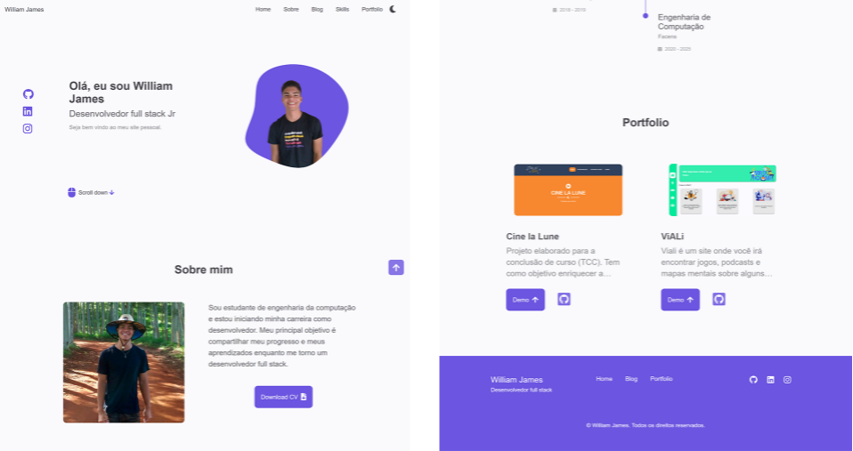

 

  <h3 align="center">Portfólio</h3>

  

   Este é meu portfólio.
  

  
Índice

  <ol>
    <li>
      <a href="#sobre-o-projeto">Sobre o projeto</a>
      <ul>
        <li><a href="#construido-com">Construido com</a></li>
      </ul>
    </li>
    <li><a href="#licença">Licença</a></li>
    <li><a href="#contato">Contato</a></li>
  </ol>

## Sobre o projeto

 
Este projeto foi construído com a intenção de ser meu portfólio.

[Visualizar meu portfólio](https://williamjames-official.web.app/).

### Construído com

O projeto foi construído utilizando

- [Reactjs](https://reactjs.org)
- [Firebase](https://firebase.google.com)

## Licença

Distribuído sob a licença MIT. Veja `LICENSE` para maiores informações.

## Contato

William James - william.james.pj@gmail.com

Link do projeto: [https://github.com/william-james-pj/william-james-portfolio](https://github.com/william-james-pj/william-james-portfolio)
